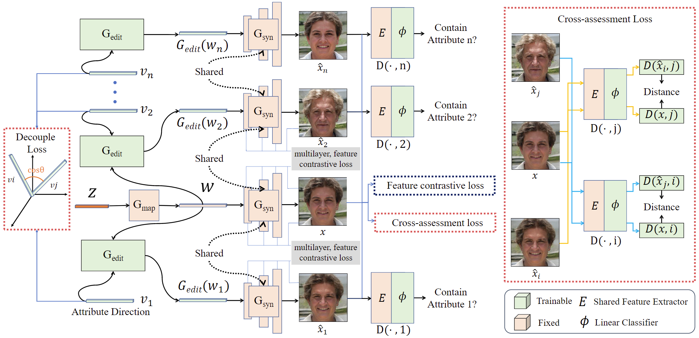

# FEditNet++
[TPAMI 2024] FEditNet++: Few-Shot Editing of Latent Semantics in GAN Spaces with Correlated Attribute Disentanglement

###  [Paper](https://ieeexplore.ieee.org/document/10607942) | [Suppl](10.1109/TPAMI.2024.3432529/mm1)

<!-- <br> -->
[Ran Yi](https://scholar.google.com/citations?hl=zh-CN&user=y68DLo4AAAAJ),
[Teng Hu](https://scholar.google.com/citations?hl=zh-CN&user=Jm5qsAYAAAAJ),
[Mengfei Xia](https://scholar.google.com/citations?hl=zh-CN&user=jmOlxQ0AAAAJ), 
[Yizhe Tang](https://github.com/sjtuplayer/FEditNet2),
 and [Yong-Jin Liu](https://scholar.google.com.hk/citations?hl=zh-CN&user=GNDtwWQAAAAJ),
<!-- <br> -->




# Prepare

```bash
pip install requirements.txt
```


## Training Step

### (0) Prepare
Checkpoints prepare: Download the [StyleGAN](https://github.com/rosinality/stylegan2-pytorch) checkpoint.

Data prepare: schedule the dataset as:

```angular2html
- dataset
    - $attr1
        - 0.png
        - 1.png
        - ...
    - $attr2
        - 0.png
        - 1.png
        - ...
    - ...

```
where `$attri` if the name for the ith attribute, e.g., Smile, Old.
### (1) Train FEditNet++ to disentangle two attributes

To train train the model on tow attributes `attri` and `attrj`, you can run:

```
python3 train_editnet.py --attr1=$attri --attr2=$attrj
```

### (2) Test the trained model

After training the model, you can generate image by running:
```
python3 test-decoupled_generator.py --attr=$attri-$attrj
```

[//]: # (With the trained coarse-stage model, you can train the refinement-stage model by running:)

[//]: # ()
[//]: # (```)

[//]: # (python3 main_refine --data_path=$path_to_the_dataset)

[//]: # (```)

[//]: # ()
[//]: # (After training, the checkpoints and logs are saved in the directory `output_refine`.)

## Citation

If you find this code helpful for your research, please cite:

```
@article{yi2024feditnet++,
  title={FEditNet++: Few-Shot Editing of Latent Semantics in GAN Spaces with Correlated Attribute Disentanglement},
  author={Yi, Ran and Hu, Teng and Xia, Mengfei and Tang, Yizhe and Liu, Yong-Jin},
  journal={IEEE Transactions on Pattern Analysis and Machine Intelligence},
  year={2024},
  publisher={IEEE}
}
```